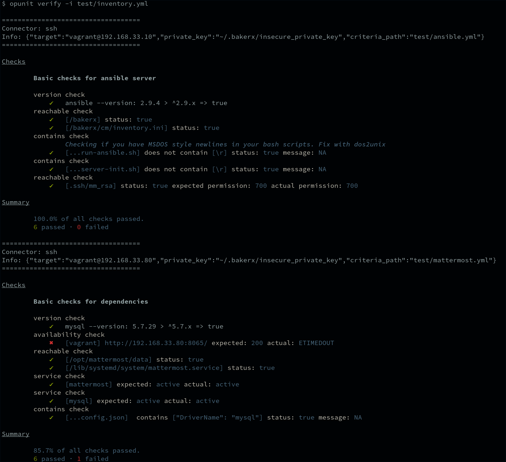
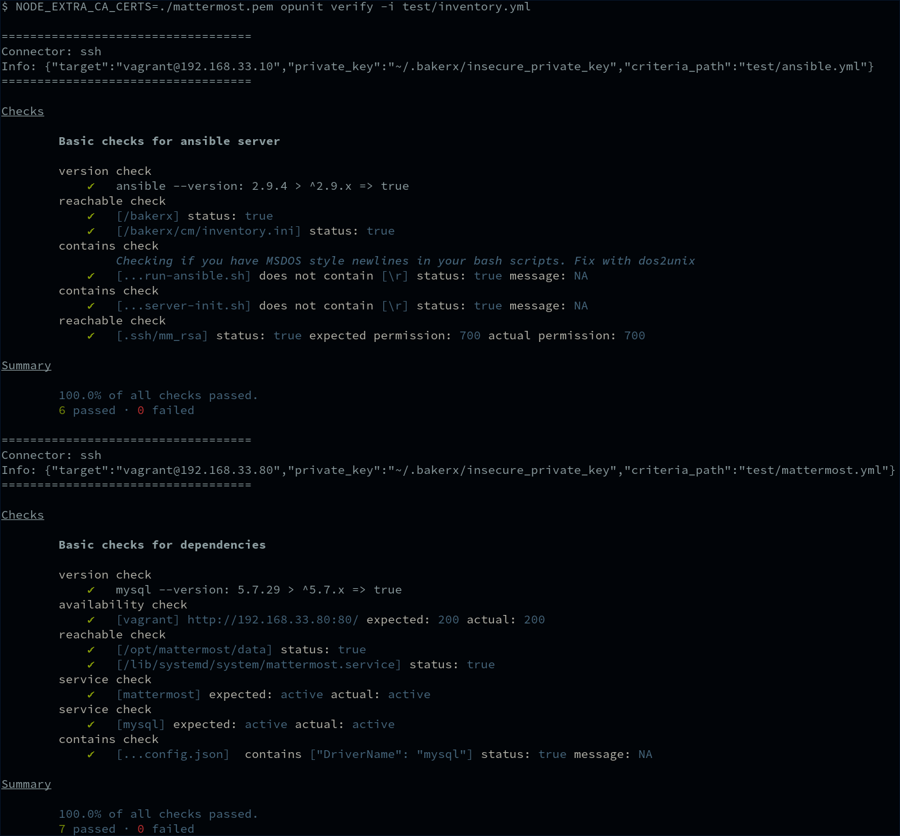

# HW2

### Get started

Clone this repo:

```bash
git clone https://github.ncsu.edu/jwmanes2/HW2-DevOps.git
```

Install the node.js packages.

```
npm install
npm link
```

You can run the `cm setup` command to :

1. Provision the configuration server VM (with ip, sync folders)
2. Provision the mattermost VM (with ip)
3. Copy over the private key for the mattermost VM.
4. Install ansible on the config server.

*Note*: You must run `cm setup` while your cwd is inside the HW2-DevOps folder in order for the current sync path to be setup.

You can also run `cm playbook cm/playbook.yml cm/inventory.ini .vault_pass.txt`. Note: `.vault_pass.txt` should contain the password to the Ansible Vault containing
passwords for Mattermost system and database users.

### Opunit
As reported at https://stackoverflow.com/c/ncsu/questions/1416, an extra credit option is to configure NGINX with SSL which included steps to deny incoming traffic on port 8065, so the following screenshots show opunit results with various configurations.


The opunit tests do not handle optional extra credit configuration involving firewall and nginx.


With the mattermost-srv availability port check changed to port 80 and with the mattermost-srv SSL certificate added as a trusted certificate, all opunit checks pass.

### Evaluation
[x] Install Ubuntu 18.04 LTS
[x] Install MySQL Database Server
[x] Install Mattermost Server
[x] Finalize configuring the mattermost server
[x] Create a team and users
[x] Demonstrate you can actually use mattermost by posting some messages
[x] Use best practices
[x] Everything is setup automatically. No manual steps.
[x] Limited use ansible galaxy roles. The only Ansible Galaxy role use is `geerlingguy.mysql` to install mysql

#### Extra requirements
[x] (5 points) Automate the creation of teams and other mattermost server configuration
    - Implemented custom Ansible module for idempotent Mattermost configuration
    - Used mattermost bulk import API for creation of teams, channels, and users
[x] (5 points) Configure the ability to send email notifications
[x] (10 points) Complete the section "Configuring NGINX as a proxy for Mattermost Server" in mattermost installation instructions
[x] (5 points) Complete the section "Configuring NGINX with SSL and HTTP/2". Note you can setup a local hosts file for enabling temporary testing of your SSL configuration.
    - The section described using Lets Encrypt which performs some external validation including that the configured CN is resolvable via DNS and the server is externally reachable for HTTP validation which is not possible with a host-only network configuration without additional host networking configuration (e.g packet routing), so I opted for a sign-signed SSL certificate instead.
    
### Screencast
    
